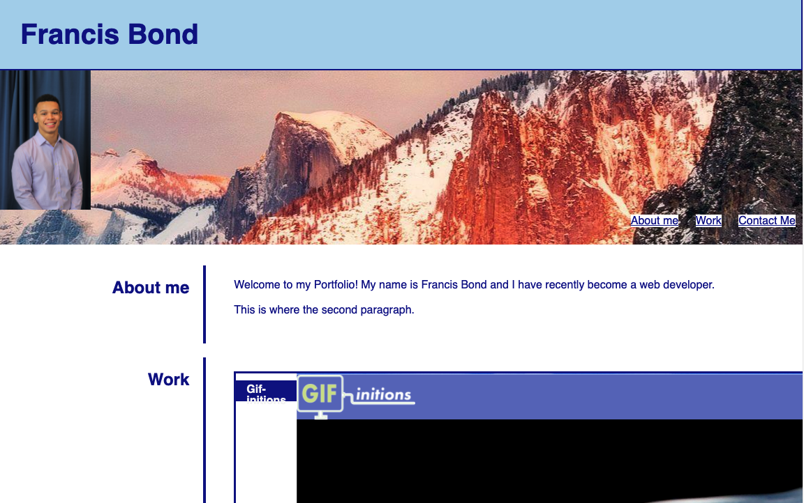

# Portfolio v1

Title: Portfolio v1

Developer: Francis Bond

Deployment Date: Jan 19, 2022

For: UT Coding Bootcamp

Published: GitHub 

Built with: HTML, CSS

## Summary

This application is built purely with html and css to display my projects and more information about me.

## Development

I was tasked with building a html framework to display my information and use css to organize it into a easy to be read webpage.

Deployed project [link](https://francis-bond.github.io/portfolio1/)